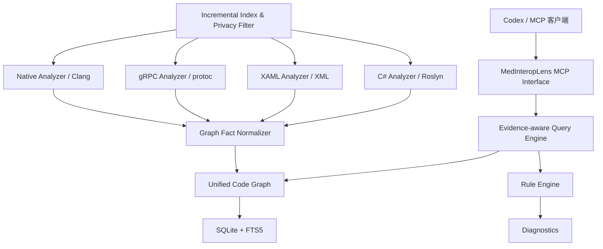

# MedInteropLens 架构评估（Phase 0）

> 评估日期：2026-07-23  
> 执行范围：`MedInteropLens_Codex_WorkPlan_v2.md` 第 15 节，仅做仓库评估。  
> 结论状态：**本地基线为空；以下目标架构尚未实现。**

## 1. 当前状态

| 检查项 | 结果 | 证据/含义 |
|---|---|---|
| 工作区 | 评估开始时含隐藏项在内为 0 个条目；当前仅有本次 4 份 Phase 0 文档 | 没有可分析或编译的 MedInteropLens 源码 |
| Git | 不是有效 Git 仓库 | 无分支、提交、remote 或变更基线 |
| 工程与测试 | 不存在 `.sln`、`.slnx`、`.csproj`、`CMakeLists.txt`、`.proto` 或测试文件 | 当前项目的编译、测试状态均为“不可执行”，不是“通过”或“失败” |
| MCP 能力 | 本地不存在 | 无服务器、工具注册或协议测试 |
| 数据库 | 本地不存在 | 无 SQLite 文件、DDL 或迁移 |
| 实体 `AGENTS.md` | 工作区及祖先目录未发现 | 本次遵守会话注入的“编程任务优先使用 ripgrep”规则 |
| 可用基础工具 | Git 2.53.0、.NET SDK 10.0.301、MSBuild 18.6.4、ripgrep 15.1.0 | 足够进行 .NET 基线工作 |
| 缺失后续工具 | Clang/Clang++、CMake、Ninja、protoc、MSVC/Visual Studio 均不在 PATH 或未被发现 | 不阻塞 Phase 0，但阻塞后续 Native TestAssets 和 C/C++ 分析 |

因此，本文件同时记录两种状态：

1. **当前态**：空工作区。
2. **候选目标态**：基于推荐上游能力的最小演进架构，不代表已经实现。

## 2. 推荐上游基线

工作计划中的 `DevBitsLab.Mcp.SourceGraph` 实际公开仓库所有者不是
`DevBitsLab`，而是
[`Jak3b0/DevBitsLab.Mcp.SourceGraph`](https://github.com/Jak3b0/DevBitsLab.Mcp.SourceGraph)。
Phase 0 固定评估提交：
[`6b32a8b9b353c30322889d5ab644c2d19bca779a`](https://github.com/Jak3b0/DevBitsLab.Mcp.SourceGraph/tree/6b32a8b9b353c30322889d5ab644c2d19bca779a)。
该项目采用 MIT 许可证。

候选上游已经提供以下分层：

| 上游项目 | 当前职责 | 对 MedInteropLens 的用途 |
|---|---|---|
| `Core` | 文件、符号、引用、边、诊断等模型 | 可作为图事实的实现基础，但不能直接充当最终统一领域模型 |
| `Indexing` | Roslyn/MSBuildWorkspace C# 索引、增量重建 | Phase 1 的 C# 分析基础 |
| `Indexing.Xaml` | WPF/WinUI/UWP/Avalonia/Uno XAML 解析和跨语言边 | Phase 1 的 WPF 起点 |
| `Storage` | SQLite、FTS5、sqlite-vec、scope 数据库 | 保留并增量扩展，禁止重写 |
| `Watcher` | `.cs` 与 Git HEAD 监听 | 可复用，但必须补齐 XAML 和删除场景 |
| `Server` | MCP stdio、查询工具、scope 路由、插件宿主 | MCP 接口和查询引擎基础 |
| `Sdk` | 语言索引器、图事件、插件扩展点 | 后续 proto/native 分析器的首选接入点，但当前不是即插即用 |
| `Tests` | 单元、集成、WPF fixture、漂移恢复 | 可保留并扩展为医疗跨层 TestAssets |

上游结构和工具说明见其
[`README.md`](https://github.com/Jak3b0/DevBitsLab.Mcp.SourceGraph/blob/6b32a8b9b353c30322889d5ab644c2d19bca779a/README.md)，
真实存储定义见
[`Schema.cs`](https://github.com/Jak3b0/DevBitsLab.Mcp.SourceGraph/blob/6b32a8b9b353c30322889d5ab644c2d19bca779a/src/DevBitsLab.Mcp.SourceGraph.Storage/Schema.cs)。

SDK 当前的
[`CanonicalKeyValidator`](https://github.com/Jak3b0/DevBitsLab.Mcp.SourceGraph/blob/6b32a8b9b353c30322889d5ab644c2d19bca779a/src/DevBitsLab.Mcp.SourceGraph.Sdk/Validation/CanonicalKeyValidator.cs)
只接受 `csharp`、`xaml`、`js`、`ts`、`jsx`、`tsx`。`proto:`、`c:` 或
`cpp:` 会被拒绝，所以未来语言不能只靠外部插件完成；需要在 fork 中扩展并冻结
canonical-key 合同。

## 3. 目标架构



依赖方向必须保持为：

`MCP -> Query/Rules -> Unified Model -> Storage abstractions`

分析器只产生统一图事实，不应依赖 MCP 输出 DTO；MCP 层也不应暴露
Roslyn、Clang 或 protoc 的第三方对象。

## 4. 统一模型差距

工作计划要求的核心模型与候选上游当前模型并不等价。

### 4.1 Symbol

上游 `Symbol` 已有名称、FQN、种类、文件、区间、签名和容器，但缺少：

- `Language`
- `Project`

上游模型证据：
[`Models.cs`](https://github.com/Jak3b0/DevBitsLab.Mcp.SourceGraph/blob/6b32a8b9b353c30322889d5ab644c2d19bca779a/src/DevBitsLab.Mcp.SourceGraph.Core/Models.cs)。

建议在 MedInteropLens 领域层提供稳定的 `Symbol`，通过 canonical-key scheme
推导或持久化语言，并从 solution/project 映射补齐项目。不要让上游模型成为 MCP
公开契约。

### 4.2 Edge 与证据

上游 `Edge` 只有 `Src`、`Dst`、`Kind` 和可选 JSON metadata；`edges` 表也没有
调用点文件/行列、证据文本或可信度。位置级 `refs` 可以证明单个引用，但不能为
所有继承、XAML、跨语言和传递影响边提供统一证据。

工作计划要求每条分析结果具有：

- 文件路径
- 行号
- 符号名称
- 关系类型
- 可信度（`Exact` / `Semantic` / `Inferred`）

因此下一阶段应采用**附加式证据模型**，例如一条逻辑边对应一到多条
`EdgeEvidence`，而不是破坏性替换现有 `edges` 表：

```text
EdgeEvidence
  EdgeKey(source, target, type)
  FilePath
  StartLine / StartColumn
  EndLine / EndColumn
  EvidenceText
  Confidence
  Producer
```

查询引擎必须拒绝把“无证据边”包装成确定结论；允许返回
`unresolved`/`inferred`，但必须明确标注。

## 5. 数据库现状与演进边界

候选上游 schema version 为 11，主要对象包括：

- `files`
- `symbols`
- `refs`
- `edges`
- `annotations`
- `diagnostics`
- `symbol_history`
- `embedding_meta`
- `symbols_fts`、`annotations_fts`
- 可选 `symbol_embeddings`

每个 scope 使用独立数据库，另有 `_meta.db` scope registry。符号搜索使用 FTS5
trigram；可选语义搜索使用 sqlite-vec。现有 schema 升级策略会在版本不匹配时
丢弃可重建索引并重建，这适合派生索引，但上线前仍需验证大型仓库的重建时间和
并发查询行为。

Phase 1 只允许：

- 复用现有 SQLite/FTS5；
- 添加证据、语言或项目所需的最小 schema；
- 提供迁移/重建测试；
- 保持已有查询兼容。

禁止以“统一模型”为由重写整个数据库。

## 6. Phase 1 能力边界

Phase 1 只建立可靠的 C#/WPF 知识图谱和六个查询：

- `find_definition`
- `find_reference`
- `find_callers`
- `find_callees`
- `trace_call_path`
- `impact_analysis`

明确不进入 Phase 1 的内容：

- ClangSharp/C++ AST
- P/Invoke/ABI 规则
- gRPC/proto 合同
- 完整 WPF → gRPC → C++ 链
- 风险规则引擎的 Interop 规则

这些能力只能在基础图的证据契约、增量一致性和删除语义通过测试后继续。

## 7. 隐私边界

系统默认应保持本地索引；任何模型下载、遥测或代码内容离开设备都必须显式说明。
医疗默认排除策略必须在遍历、watcher、冷索引和漂移修复四条入口一致执行：

`bin`、`obj`、`.vs`、`Debug`、`Release`、`Images`、`PatientData`、
`Database`、`Logs`、`*.dcm`、`*.jpg`、`*.png`。

候选上游支持 scope `exclude`，但上述医疗目录和扩展名并非统一内置默认值；
其 `SourceTreeWalker`/`SolutionWatcher` 当前硬编码集合也较小。该差异是
Phase 1 的上线阻断项，而不是可选优化。

“本地运行”也不等于“安全读取”：加载 `.sln` 可能执行 MSBuild 逻辑、Roslyn
analyzer/source generator，插件则直接运行在 MCP host 进程。上游自身的
[`SECURITY.md`](https://github.com/Jak3b0/DevBitsLab.Mcp.SourceGraph/blob/6b32a8b9b353c30322889d5ab644c2d19bca779a/SECURITY.md)
把恶意工程/插件造成的代码执行列为风险。MedInteropLens 必须采用可信仓库/插件
白名单、非特权账户，并为不可信分析建立隔离进程，而不能把
`AssemblyLoadContext` 当作安全沙箱。

## 8. 架构结论

推荐采用“**固定提交的上游 fork + MedInteropLens 领域外壳 + 附加式证据模型**”：

1. 上游已经覆盖 Roslyn、XAML、SQLite/FTS5、MCP 和插件扩展，复用价值高。
2. 直接安装上游工具无法满足统一模型、医疗隐私和逐边证据要求。
3. 独立再造图数据库或第二套 MCP 服务器会增加一致性风险，不建议。
4. 在供应链门禁通过前，不应把候选上游复制到主工作区并宣称为可用基线。
