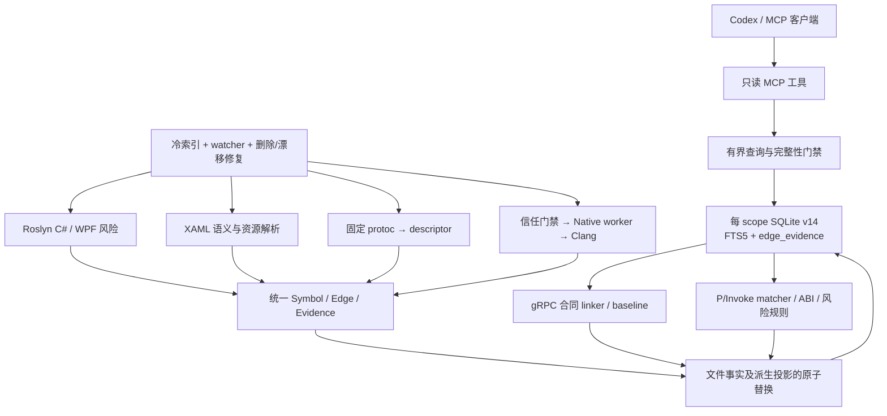

# MedInteropLens 架构现状

> 状态日期：2026-07-24
> 当前产品版本：`DevBitsLab.Mcp.SourceGraph.Tool` 0.9.0；插件 SDK 2.5.0。
> 本文描述仓库中已经实现并由测试覆盖的架构。最初的 Phase 0 空仓库评估保留在文末，作为决策历史，不再代表当前状态。

## 1. 架构结论

MedInteropLens 已经在固定上游 `DevBitsLab.Mcp.SourceGraph` 的分层上完成了面向
WPF/C#/gRPC/protobuf/P/Invoke/C/C++ 的本地证据图扩展。系统没有另建第二套图数据库
或第二个 MCP 宿主；语言分析器统一输出 canonical key、图事实和逐次证据，SQLite
负责原子发布，stdio MCP 工具只查询已持久化且满足完整性条件的事实。



依赖方向仍保持为：

`Server/MCP → Query/Rules → Core/SDK contracts → Storage`

Roslyn、Clang、protobuf descriptor 等第三方对象停留在 analyzer adapter 内部，不进入
持久化模型或 MCP 返回 DTO。

## 2. 模块与职责

| 模块 | 当前职责 |
|---|---|
| `Core` | scope、符号、关系、证据、Interop/ABI 归一化事实、隐私路径和执行信任合同 |
| `Sdk` | `ILanguageIndexer`、`IndexEvent`、开放的 symbol/edge kind、`EdgeEvidence`，以及 `csharp:`、`xaml:`、`proto:`、`c:`、`cpp:` canonical-key 合同 |
| `Indexing` | Roslyn solution 索引、调用/引用/继承、Command 执行、managed interop/layout/usage、protoc descriptor 投影、WPF 风险诊断 |
| `Indexing.Xaml` | WPF 等 XAML dialect、`x:Class`、Binding、Command、事件、资源及项目级资源快照 |
| `Indexing.Clang` | 目标 ABI 感知的 native 声明、导出、record/enum/type、直接调用及可证明风险事实提取 |
| `Interop` | P/Invoke 匹配、PE export 核验、ABI struct 比较、`Interop001`–`Interop006` 规则 |
| `Storage` | 每 scope SQLite/FTS5、schema v14、逐次边证据、原子文件/producer/native 投影、gRPC 首次成功基线、只读查询 |
| `Watcher` | `.cs`、XAML、proto、native 输入和 Git HEAD 的增量变更批次 |
| `Server` | stdio MCP、scope 路由、完整性状态、live indexing、gRPC/native 协调器、查询预算及结构化输出 |
| `Embeddings` | 可选本地 ONNX + sqlite-vec 语义索引；模型下载默认不隐式发生 |
| `Indexing.TreeSitter` / `Indexing.TypeScript` | 保留上游的开放语言扩展，不参与 MedInterop 完整链的权威判定 |

## 3. 统一图与证据合同

### 3.1 符号身份

每个声明以稳定 canonical key 唯一标识。当前权威 scheme 包括：

- `csharp:`：Roslyn 语义符号；
- `xaml:`：view、element、resource 等声明；
- `proto:`：message、field、service、RPC；
- `c:`：C ABI export；
- `cpp:`：C++ function/method/record 等。

存储中的 `symbols` 保存名称、FQN、kind、文件、1-based 范围、签名和容器。语言可由
scheme 确定；project/scope 由文件所属的索引上下文确定。精确 canonical-key 查询不会
退化成模糊名称匹配，歧义名称也不会静默选取任意候选。

### 3.2 逻辑边与发生点证据

schema v13 起，`edges` 只表示去重后的逻辑关系，`edge_evidence` 保存一对多发生点：

- producing file；
- 1-based、end-exclusive 范围；
- `Exact` / `Semantic` / `Inferred`；
- producer；
- 发生点 payload/metadata。

同一 caller/callee 的多个调用点不会因逻辑边去重而丢失。删除文件或刷新 producer
时只删除其拥有的证据；当最后一条证据消失时，逻辑边才被移除。传递查询逐 hop 返回
证据，路径可信度不能高于最弱 hop。

主要关系包括普通 `calls`、`references`、`reads`、`writes`、`inherits`、
`implements`，以及 `binds-path`、`command-executes`、`grpc-calls`、
`implements-rpc`、`rpc-dispatches-to`、`pinvoke-maps-to` 和 `struct-maps-to`。

### 3.3 原子所有权

图写入按事实所有者区分：

- `ReplaceFileFactsAsync`：一次替换一个源文件的完整声明、边/证据、annotation 和引用；
- producer/file 与 producer/scope 投影：只替换某一派生分析器拥有的证据；
- multi-file derived projection：跨文件候选全部验证后一次提交；
- native snapshot：一次替换完整 native 事实，随后刷新 managed boundary，最后才清理
  已证明孤立的旧 native symbol；
- gRPC baseline：只插入同一 exact canonical key 的首次完整成功观察，正常索引不会
  覆盖历史基线。

验证、端点解析或写入失败时，事务回滚并保留上一份完整投影。

## 4. 索引与派生流水线

### 4.1 C# 与 WPF

`RoslynIndexer` 使用 `MSBuildWorkspace` 建立经隐私清理的 solution 快照，分阶段发布
声明、annotation、引用/边和 diagnostics。它提取类、接口、方法、属性、字段、调用、
读写、继承/实现、generated document，以及：

- managed `DllImport` / `LibraryImport`、`StructLayout`、`MarshalAs`；
- managed ABI record layout；
- callback rooting 和返回内存释放 usage；
- `ICommand` 属性到直接 lambda/方法执行体的 `command-executes`。

`Indexing.Xaml` 解析 XAML dialect，并利用完整 Roslyn compilation 解析 DataContext、
Binding 和 Command。只有唯一语义目标才发布跨语言边；missing、ambiguous、
unsupported 和 incomplete 以结构化 outcome/finding 保存，不制造 placeholder
“确定结果”。项目级资源快照处理 local/application/merged resource dictionaries。

已实现的 WPF 初始规则为：

| 规则 | 代码/事实 | 保守边界 |
|---|---|---|
| Binding 不存在 | `XAMLBINDING001` | 仅在语义上下文完整且能证明成员缺失时告警 |
| Command 不存在 | `XAMLCOMMAND001` | 同时验证目标成员和 `ICommand` 类型 |
| Resource 不存在 | `XAMLRESOURCE001` | 仅在相关资源快照完整时把缺失视为结论 |
| 事件未解绑 | `WPFEVENT001` | 仅 source-defined static event、直接 named instance handler、完整无编译错误 compilation，且找不到 exact `-=` |
| UI 线程风险 | `WPFTHREAD001` | 仅已知 BCL 后台入口中的 inline callback，且 receiver 静态继承 `DispatcherObject`；直接 Dispatcher marshal 会抑制告警 |

### 4.2 protobuf 与 gRPC

`.proto` 不使用手写 parser。`ProtobufLanguageIndexer` 将经过 scope/物理路径策略批准的
输入复制到临时目录，调用 Grpc.Tools 2.82.0 提供的固定 `protoc`，请求 imports 和
source info，再由 `Google.Protobuf.Reflection` 投影 message、field、service、RPC
及版本化合同 annotation。编译有超时、输入/输出和声明数量上限。

`GrpcContractLinker` 只消费完整、严格解码的 proto 合同和已有 occurrence evidence 的
Roslyn 图。生成代码的 service container、descriptor、请求/响应类型、streaming
signature 必须唯一一致，才会原子发布：

- managed client call → proto RPC：`grpc-calls`；
- server handler → proto RPC：`implements-rpc`（审计方向）；
- proto RPC → server handler：`rpc-dispatches-to`（执行方向）。

派生投影刷新期间状态先变为 `Partial`。失败时若数据库确有旧 producer 证据才报告
`RetainedLastGood=true`，不会把旧投影视为当前否定证据。合同检查支持 RPC 无实现、
唯一可证的 client/server signature mismatch、field number change 和 streaming
shape change；变更规则使用首次完整成功基线，首次观察本身不是变更。

### 4.3 Native / Interop / ABI

Native 流水线由 `NativeInteropCoordinator` 串行执行：

1. 用户级信任文件授权当前 repository 的 `NativeParsing` capability；
2. 固定协议启动独立 native worker；
3. worker 对已批准的 translation unit/编译参数运行 ClangSharp/libclang；
4. 对 translation unit 和 include closure 做两次解析与 SHA-256 content binding；
5. 可选地核验目标架构/配置的 PE export table；
6. 原子发布 native symbol、direct call 和风险事实；
7. 匹配 managed import，发布 `pinvoke-maps-to`、finding 和 ABI 结果；
8. 只有所有 managed boundary 刷新成功后才删除已证明孤立的旧 native symbol。

worker 协议拒绝未知字段和越界集合，限制请求、响应、stderr、字符串、类型深度和
编译参数；client 有固定最长十分钟的进程超时。主 MCP 进程不直接加载 libclang。

规则引擎只消费目标感知的内部事实：

- `Interop001`：calling convention；
- `Interop002`：record layout，包括 size/align/pack、offset、字段、数组、bool、
  pointer width 和嵌套 record；
- `Interop003`：参数数量/方向/type category/size/pointer/sign/encoding；
- `Interop004`：native 已保留 callback 且 managed call site 已证明未 rooting；
- `Interop005`：native exception 已证明可穿越 C ABI；
- `Interop006`：native allocation family 与 managed release family 已证明不一致。

未知 target、编译参数、类型或不完整 export universe 不会产生“兼容”或“未发现风险”
的权威结论。

## 5. 完整执行链

`trace_call_path(profile="execution")` 使用固定关系白名单，能追踪 fixture 中一条连续
八跳路径：

```text
XAML Button
  --binds-path--> ICommand property
  --command-executes--> ViewModel method
  --calls--> managed service
  --grpc-calls--> proto RPC
  --rpc-dispatches-to--> server handler
  --calls--> P/Invoke declaration
  --pinvoke-maps-to--> C export
  --calls--> C++ algorithm
```

另外保留 server handler → proto RPC 的 `implements-rpc` 审计边。每个 hop 至少有一条
持久化发生点证据；gRPC 派生边同时保留 managed 和 proto 两侧证据。

查询开始和结束都会读取 SQLite connection-local/external read version，并比较
scope、gRPC 和 native runtime-state identity。图或投影状态在遍历期间变化时，已找到
的路径仍可显示，但结果标记 `query-snapshot` partial，空结果不具权威性。执行模式还
要求 scope、managed semantic input、gRPC linker、native snapshot/export universe
全部完整，且没有 retained/stale/failure 状态。

## 6. 隐私与安全边界

默认医疗排除是不可被 scope include 反向覆盖的硬边界：

`bin`、`obj`、`.vs`、`Debug`、`Release`、`Images`、`PatientData`、`Database`、
`Logs`、`.git`、`.sourcegraph`、`node_modules`、`*.dcm`、`*.jpg`、`*.jpeg`、
`*.png`。

同一 `ScopePathPolicy` 用于冷发现、language dispatcher、watcher、删除、XAML/proto
secondary input、native include closure 和 history。它同时检查 lexical path 与物理
路径，解析 symlink/junction/reparse point；无法安全解析、越出 repository 或命中排除
的路径 fail closed。schema v12 曾强制丢弃旧索引，防止隐私策略上线前采集的记录残留。

服务默认本地 stdio 运行。查询工具只读且有输入、scope、row、evidence、depth、node、
时间和约 50K 输出预算；`query_graph` 使用只读连接和受限 view。Embedding 模型下载
必须显式允许。

需要明确：solution 隐私清理发生在 MSBuild evaluation 之后，它不是恶意工程沙箱；
插件的 `AssemblyLoadContext` 也只是依赖隔离。残余安全边界见 `risk.md`。

## 7. 存储、增量和失败语义

当前 schema version 为 14：

- v12：隐私边界强制重建；
- v13：逻辑边与一对多 `edge_evidence` 分离；
- v14：insert-only `grpc_contract_baselines`。

每个 scope 使用独立数据库，`_meta.db` 记录 scope registry。FTS5 trigram 服务符号和
annotation 搜索，sqlite-vec 仅在显式启用 embeddings 时使用。

冷索引和 live indexing 共用相同 producer ownership。文件修改执行原子 replace，
文件删除事务清理 symbol/ref/edge/evidence/annotation/diagnostic/history/embedding，
结构变化触发 workspace reload；派生投影失败时保留 last-good 并显式降级为 partial，
不会将“分析未完成”等同于“没有问题”。

## 8. 验证策略

验证分为四层：

1. 归一化模型、codec、canonical key、路径/信任和规则单元测试；
2. SQLite 原子替换、删除、producer 隔离、baseline、read-version 和损坏恢复测试；
3. Roslyn/XAML/protoc/Clang/native-worker/linker 的组件与增量测试；
4. `MedInteropChain` 合同测试：在同一 store 中运行生产 Roslyn、XAML、protobuf、
   gRPC linker、native snapshot publication、interop analysis 和 execution trace，
   对八跳 golden contract 逐边验证证据及完整性。

完整链测试为可重复性注入 native extractor/export verifier，真实 Clang extraction、
worker protocol、PE verifier 和 WPF Windows fixture 由独立测试覆盖。Release 交付还需
运行 locked restore、全量 build/test、漏洞扫描、pack、安装后的 `--help` 和 stdio
`tools/list` smoke。

## 9. 已知限制

- 静态图不尝试证明反射、动态代理、任意 delegate/function pointer、运行时 DI 或所有
  虚调用目标。
- WPF event/UI-thread 规则刻意只报告窄而可证明的形状；unsupported 形状是 unknown，
  不是安全证明。
- protobuf 变更基线是本地 scope 数据库中的首次完整成功观察，不替代组织级 API
  registry 或发布版本策略。
- ABI 结论只对配置的 OS/architecture/toolchain/pack 和实际核验 artifact 有效。
- Native worker 是进程隔离和资源/协议边界，不等同于容器或 OS 级强沙箱。
- 本项目是开发分析工具，不是医疗设备认证、临床验证或合规结论。

## 10. Phase 0 历史

2026-07-23 的初始评估开始于空工作区：没有 Git、solution、源码、测试、MCP 或
数据库。评估选择了 MIT 上游
`Jak3b0/DevBitsLab.Mcp.SourceGraph@6b32a8b9b353c30322889d5ab644c2d19bca779a`
作为固定基线，并识别出旧依赖 NU1903、证据模型、医疗隐私、XAML 增量和 native
隔离差距。

这些结论促成了当前的“固定上游基线 + 单一统一图 + 附加式证据 + fail-closed
派生投影”架构。旧的“工作区为空”“Native/proto 始终 out of scope”等说法只属于
当时的阶段门禁，现已由本仓库实现取代。
